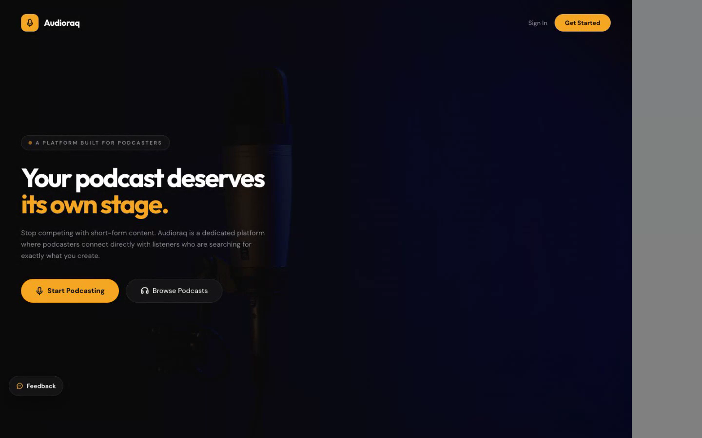
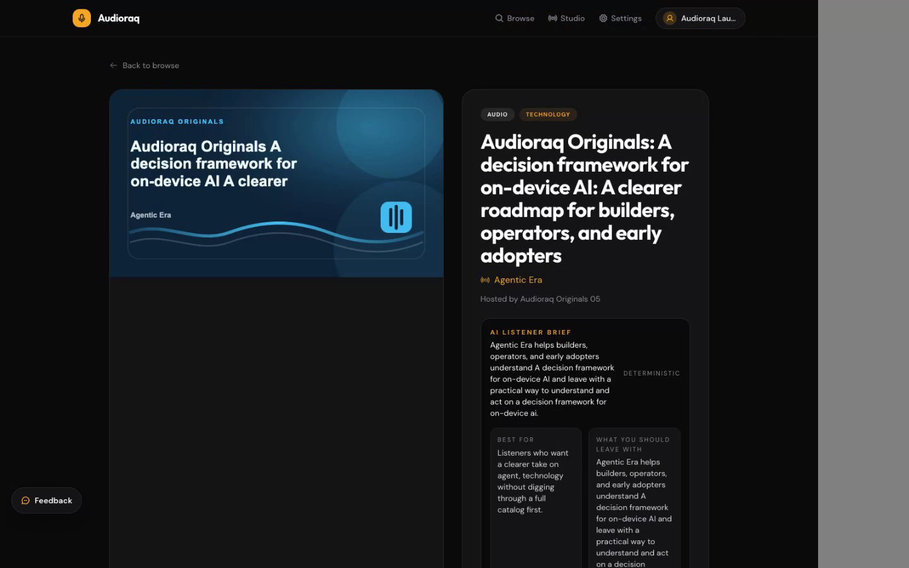
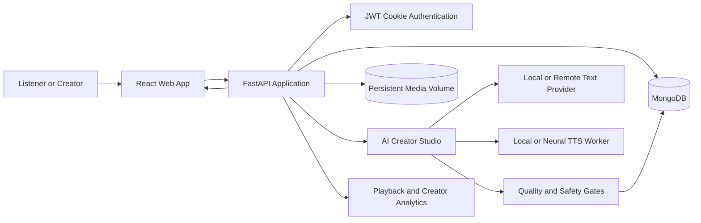
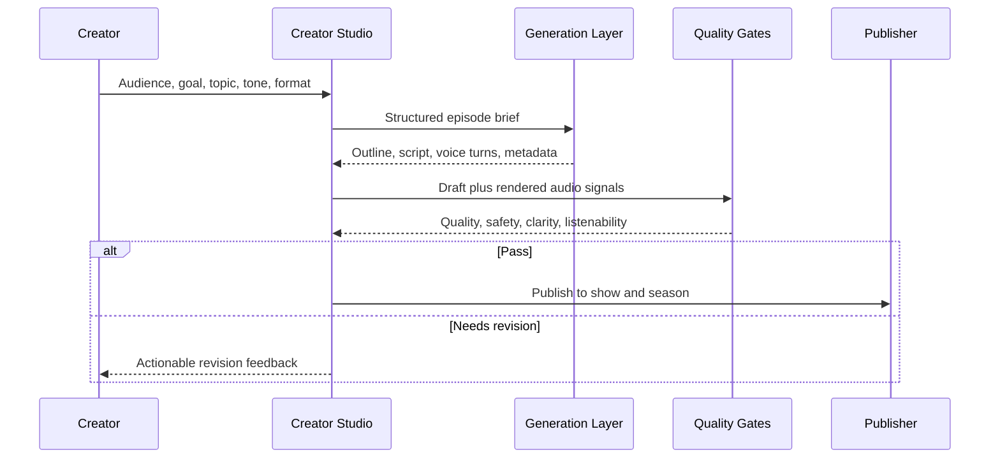

# Audioraq

**AI-first podcast creation and listening platform with quality-controlled publishing.**

[Live product](https://www.audioraq.com) | [Launch demo](frontend/public/launch/audioraq-launch-video.mp4)

Audioraq helps podcasters move from an idea to a published show without stitching together separate planning, writing, audio, hosting, and analytics tools. Listeners get a podcast-native discovery experience with show pages, episode details, queues, saves, ratings, and listening history.



## Problem Statement

Podcast creation is fragmented. A creator typically needs one tool for research, another for scripting, another for recording or synthesis, another for hosting, and a separate analytics surface. At the same time, listeners need stronger trust signals before committing to long-form audio.

Audioraq addresses both sides:

- A guided Creator Studio captures audience, goal, topic, tone, format, and growth intent before generation.
- AI-assisted audio creation produces an editable episode package instead of an opaque one-click output.
- Agentic AI quality gates review safety, factual risk, voice clarity, listenability, and publish readiness.
- A show-first catalog organizes content as **Show > Season > Episode**.
- Listener workflows turn discovery into retention through follows, saves, queues, ratings, and resume playback.

## Product Walkthrough

| Creator workflow | Listener workflow |
| --- | --- |
| Create a show and define its positioning | Browse by topic, rating, views, or recommendation |
| Generate an episode package from structured intent | Inspect quality and trust signals on episode pages |
| Review the outline, script, voice cast, and quality score | Save, queue, like, rate, and continue listening |
| Render AI-created audio or upload recorded audio/video | Follow shows and receive new-episode discovery |
| Publish, edit metadata, and review analytics | Provide feedback that informs product decisions |



## Architecture



### AI creation pipeline



## Technical Decisions

| Concern | Decision | Why it matters |
| --- | --- | --- |
| Web application | React + FastAPI in one production image | Same-origin auth and a simpler deployment surface |
| Primary data | MongoDB | Flexible show, episode, draft, analytics, and feedback documents |
| Media | Persistent local volume with legacy read fallback | Avoids quota-bound object storage for new uploads while preserving older assets |
| Authentication | Secure HTTP-only JWT cookies | Reduces token exposure in browser JavaScript |
| AI text | Provider chain with local deterministic fallback | Keeps core workflows available during provider outages or budget limits |
| Audio | Pluggable local/neural TTS worker | Separates product workflow from any single voice vendor |
| Quality | Synchronous quality and moderation gates before publish | Prevents low-quality or unsafe output from entering the public catalog |

## Tech Stack

- **Frontend:** React, React Router, Tailwind CSS, Radix UI
- **Backend:** Python, FastAPI, Motor, PyMongo
- **Data:** MongoDB
- **Media:** Persistent Docker volume with byte-range streaming
- **Audio:** FFmpeg, local TTS fallback, optional neural worker
- **Infrastructure:** Docker Compose, Caddy, Oracle Cloud Infrastructure
- **Testing:** Pytest, API smoke tests, live end-to-end regression suite

## Security Guardrails

- HTTP-only, secure authentication cookies in production
- Role-based listener, creator, and administrator authorization
- Request rate limits and upload-size constraints
- Media type and filename validation
- Server-side age and content-rating checks
- Safety review before publication
- External URL validation for RSS and redirected media
- Secrets supplied through environment variables; no production credentials belong in Git

See [Security and Data Readiness](docs/security-and-data-readiness.md) for the threat model and scaling notes.

## Repository Structure

```text
backend/          FastAPI API, storage, media, quality, and analytics
frontend/         React application and launch assets
workers/          Optional local neural TTS worker
deploy/oracle/    Docker Compose, Caddy, and OCI deployment scripts
scripts/          Migration, evaluation, and catalog utilities
tests/            Backend regression tests
docs/             Architecture, security, and launch documentation
```

## Local Setup

### Prerequisites

- Python 3.11+
- Node.js 20+
- MongoDB 7+
- FFmpeg

### 1. Configure the backend

```bash
cp backend/.env.example backend/.env
python -m venv .venv
source .venv/bin/activate
pip install -r backend/requirements.txt
```

At minimum, set a local `MONGO_URL`, `DB_NAME`, and a strong `JWT_SECRET` in `backend/.env`.

### 2. Start the API

```bash
uvicorn backend.server:app --host 127.0.0.1 --port 8001 --reload
```

### 3. Start the frontend

```bash
cp frontend/.env.example frontend/.env
cd frontend
npm install
npm run dev
```

Open `http://localhost:3000`.

## Testing

```bash
python -m pytest tests
cd frontend && npm ci && npm run build
```

For deployment verification:

```bash
curl https://www.audioraq.com/api/health
```

The production smoke suite covers public browsing, registration, listener actions, recommendations, Creator Studio, AI draft generation, AI audio publishing, recorded uploads, thumbnails, streaming, feedback, and cleanup.

## Deployment

The production stack uses Docker Compose on Oracle Cloud:

```bash
cp deploy/oracle/oracle.env.example deploy/oracle/oracle.env
bash deploy/oracle/deploy.sh
```

The deployment includes the application, MongoDB, Caddy-managed HTTPS, and persistent database/media volumes. Environment files are intentionally excluded from version control.

## Current Limitations

- Local fallback voices prioritize availability over neural voice naturalness.
- Automated safety and factual-risk checks assist moderation; they do not replace human editorial review.
- A single-node MongoDB and local media volume are appropriate for the present stage, not global-scale traffic.
- Some AI Studio operations are synchronous and should move to durable background jobs as usage grows.

## Future Improvements

- Durable background rendering with progress updates and retries
- Neural voice worker autoscaling and voice-quality regression benchmarks
- Object storage/CDN migration for global media delivery
- Cohort retention and creator activation dashboards
- Human review queues for high-risk factual or safety cases
- Accessibility and multilingual creator workflows

## Portfolio Note

Audioraq is an independently built product and an ongoing product-engineering case study. The repository documents both implemented behavior and explicit limitations so reviewers can distinguish current capabilities from planned work.
